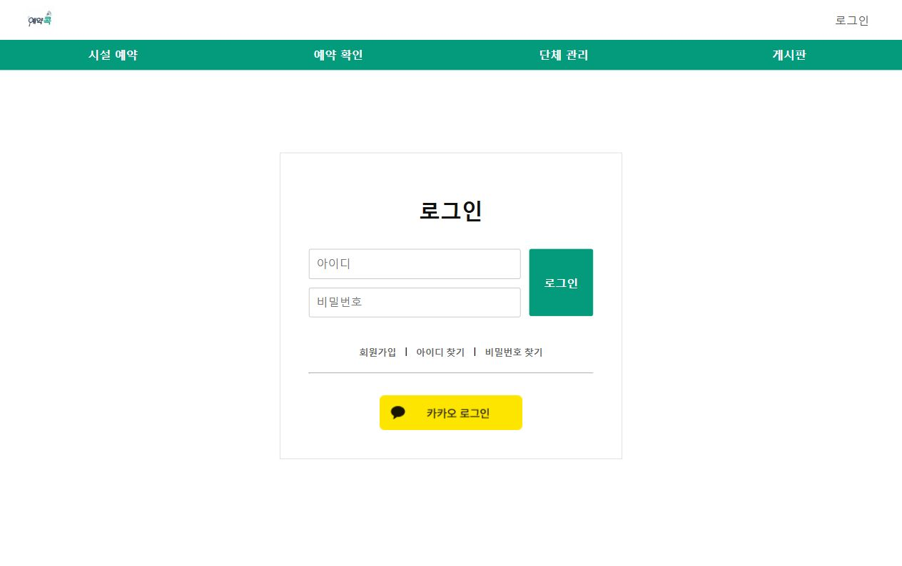
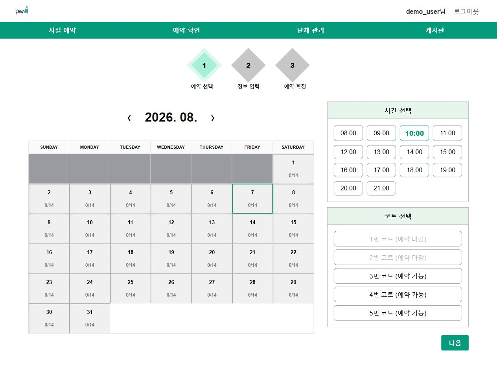
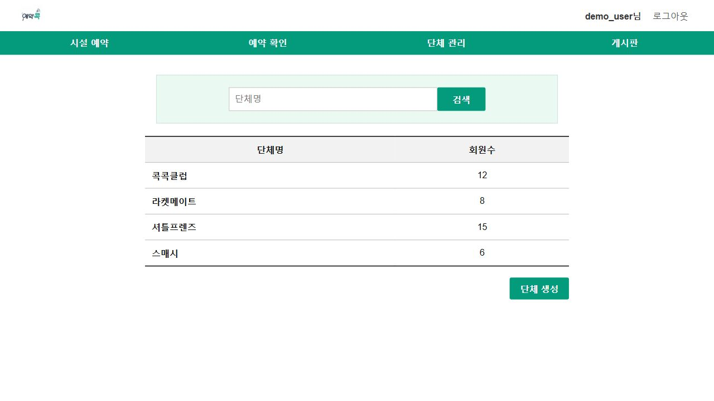
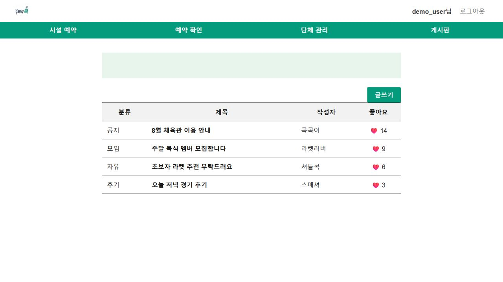
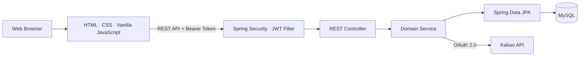
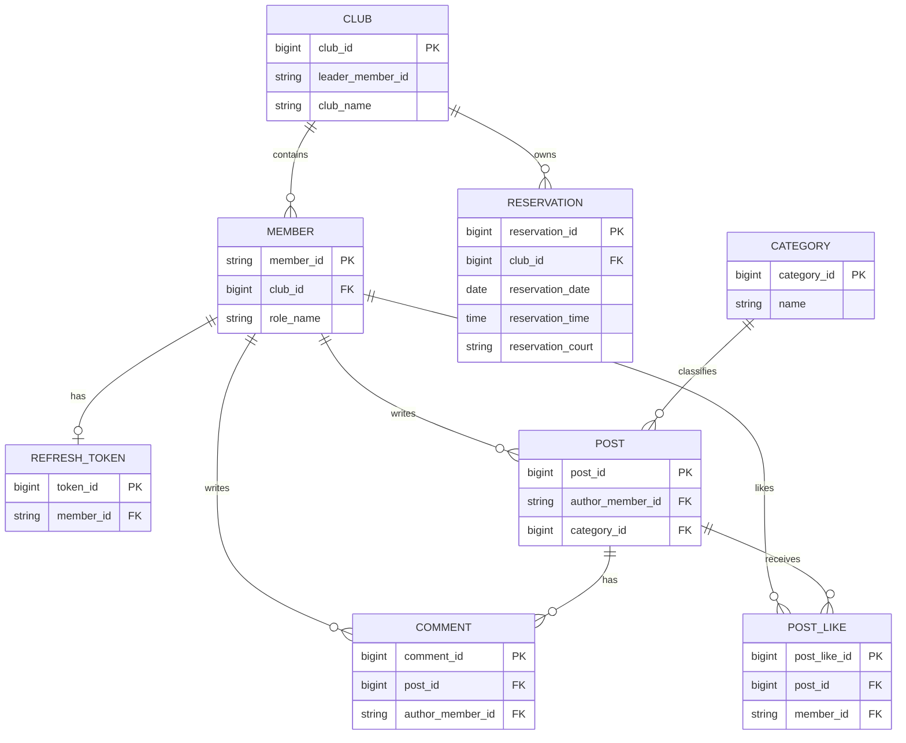

<p align="center">
  
</p>

<h1 align="center">BookKOK</h1>

<p align="center">
  Spring Boot 기반 REST API를 학습하며 만든<br>
  배드민턴 코트 예약·단체 관리 팀 프로젝트
</p>

<p align="center">
  
  
  
  
  
</p>

---

## 프로젝트 소개

BookKOK은 **Spring Boot를 활용한 REST API 개발을 학습하기 위해 진행한 4인 팀 프로젝트**입니다.

배드민턴 코트 예약이라는 도메인을 바탕으로 회원 인증, 단체 관리, 예약 처리, 게시판과 관리자 기능을 구현했습니다. 예약 도메인은 단순 CRUD뿐 아니라 사용자 인증, 역할별 권한, 엔티티 연관관계, 중복 검사와 상태 변경을 함께 경험할 수 있어 프로젝트 주제로 선정했습니다.

서비스의 규모를 키우는 것보다 기능을 직접 설계하고 구현하며 다음 질문에 답하는 것을 목표로 했습니다.

- REST API의 리소스와 엔드포인트는 어떻게 표현해야 하는가?
- Controller, Service, Repository는 어떤 책임을 가져야 하는가?
- 여러 엔티티의 상태가 함께 바뀌는 로직은 어떻게 관리해야 하는가?
- 인증된 사용자와 역할별 권한은 요청 과정에서 어떻게 검증해야 하는가?

## 학습 목표

| 학습 주제 | 프로젝트 적용 내용 |
|---|---|
| REST API | 리소스 중심 URI와 HTTP Method를 사용한 회원·예약·단체·게시판 API 설계 |
| 계층형 구조 | Controller, Service, Repository로 요청 처리·비즈니스 규칙·데이터 접근 책임 분리 |
| JPA | 엔티티 연관관계 구성과 Spring Data JPA 기반 데이터 조회·저장 |
| 인증·인가 | Spring Security, JWT, BCrypt와 카카오 로그인을 활용한 인증 흐름 구현 |
| 트랜잭션 | 예약 생성과 단체 가입·탈퇴·강퇴·위임 과정의 상태 변경 관리 |
| 협업 | 기능별 역할 분담과 Git·GitHub를 활용한 코드 통합 |

## 팀원 및 담당 영역

| 이름 | 역할 | 담당 영역 |
|---|---|---|
| **석종수** | 팀장 | 예약 시스템, 관리자 기능, 프로젝트 관리 |
| **안제홍** | 팀원 | 코트 관리, 게시판 |
| **이진희** | 팀원 | 단체 기능, 예약 조회 및 취소 |
| **정민주** | 팀원 | JWT 인증·인가, 카카오 로그인, 자체 회원가입·로그인, 마이페이지 |

## 실행 화면

> 화면 구성 확인을 위해 예시 데이터를 사용한 로컬 실행 화면입니다.

| 로그인 | 시설 예약 |
|---|---|
|  |  |

| 단체 관리 | 게시판 |
|---|---|
|  |  |

## 구현 기능과 학습 내용

| 기능 | 주요 구현 | 학습 내용 |
|---|---|---|
| 회원·인증 | 자체 회원가입·로그인, 카카오 로그인, 회원정보 관리 | 인증 흐름, 비밀번호 암호화, JWT 발급과 검증 |
| 예약 | 월·일별 현황 조회, 예약 생성·상세 조회·취소 | REST API, 요청 검증, 중복 예약 검사 |
| 단체 | 생성, 검색, 가입, 탈퇴, 강퇴, 단체장 위임·삭제 | 엔티티 상태 변경, 권한 검사, 트랜잭션 |
| 게시판 | 게시글, 댓글, 카테고리, 좋아요 | CRUD, 연관관계, 작성자 권한 검사 |
| 관리자 | 회원 차단, 전체 예약 조회·취소, 카테고리 관리 | 역할 기반 접근 제어, 관리용 API 분리 |

## 시스템 구성



백엔드는 기능 단위로 패키지를 나누고, 각 도메인 안에서 Controller, Service, Repository, DTO, Entity 계층을 구성했습니다.

```text
com.bookkok
├── member        # 회원, 자체 로그인, 카카오 로그인, 토큰
├── security      # JWT 필터와 Spring Security 설정
├── reservation   # 예약 생성, 조회, 취소
├── club          # 단체와 소속 회원 관리
├── board         # 게시글, 댓글, 카테고리, 좋아요
├── admin         # 회원, 예약, 카테고리 관리
├── global        # 공통 설정
└── view          # 화면 경로 전달
```

## REST API 설계

회원, 예약, 단체와 게시글을 각각 리소스로 구분하고 기능의 성격에 맞춰 HTTP Method와 상태 코드를 사용했습니다.

- 리소스는 `/members`, `/reservations`, `/clubs`, `/posts`와 같이 명사로 표현
- 조회는 `GET`, 생성은 `POST`, 전체 수정은 `PUT`, 일부 상태 변경은 `PATCH`, 삭제는 `DELETE` 사용
- 단건 대상은 Path Variable, 조회 조건은 Query Parameter로 전달
- 생성 성공은 `201 Created`, 삭제 성공은 `204 No Content`로 응답
- 요청과 응답 DTO를 사용해 API 입력·출력과 엔티티를 구분
- 인증된 사용자 정보는 `Principal` 또는 `AuthenticationPrincipal`을 통해 서비스에 전달

### 대표 API

| 동작 | Method | Endpoint | 응답 |
|---|---|---|---|
| 로그인 | `POST` | `/api/auth/login` | Access·Refresh Token 발급 |
| 예약 현황 조회 | `GET` | `/api/reservations/calendar` | 기간 내 예약 목록 |
| 예약 생성 | `POST` | `/api/reservations` | `201 Created`와 예약 ID |
| 예약 취소 | `DELETE` | `/api/reservations/{reservationId}` | `204 No Content` |
| 단체 가입 | `POST` | `/api/clubs/{clubId}/join-requests` | 가입 처리 결과 |
| 단체장 위임 | `PATCH` | `/api/clubs/{clubId}/leader` | `204 No Content` |
| 게시글 작성 | `POST` | `/api/posts` | `201 Created`와 게시글 ID |
| 댓글 작성 | `POST` | `/api/posts/{postId}/comments` | `201 Created`와 댓글 ID |
| 회원 차단 | `PATCH` | `/api/admin/users/{memberId}/block` | 변경된 차단 상태 |

## 주요 학습 및 구현 경험

각 팀원이 담당한 영역에서 하나의 구현 사례를 선정했습니다. 공통적으로 Controller는 HTTP 요청과 응답 변환을 담당하고, Service는 권한과 상태 변경 같은 비즈니스 규칙을 처리하며, Repository는 데이터 접근을 담당하도록 역할을 나눴습니다.

### 석종수 — 예약 현황과 중복 검사

기간 또는 날짜를 기준으로 예약 목록을 조회하는 API를 구성하고, 클라이언트에서 해당 데이터를 이용해 시간대별 예약 현황과 선택 가능한 코트를 표시했습니다.

예약을 저장할 때는 화면의 선택 상태만 신뢰하지 않고 서버에서 `날짜 + 시간 + 코트` 조합의 기존 예약을 다시 확인합니다. 이를 통해 클라이언트 검증은 사용성을 위한 것이며, 실제 비즈니스 규칙은 서버에서도 검증해야 한다는 점을 학습했습니다.

현재 방식은 기존 예약을 조회한 후 새로운 예약을 저장하므로 동시에 여러 요청이 들어오는 상황까지 완전히 막지는 못합니다. 데이터베이스 Unique Constraint 또는 락을 적용하는 것을 후속 개선 과제로 남겼습니다.

### 안제홍 — 게시판 작성자 권한과 좋아요 상태 관리

게시글과 댓글의 수정·삭제 요청에서는 현재 로그인한 회원과 작성자의 ID를 비교해 본인이 작성한 데이터만 변경할 수 있도록 Service 계층에서 검증했습니다. 화면에서 버튼을 숨기는 것만으로는 권한을 보장할 수 없기 때문에 서버에서 요청자의 권한을 다시 확인하도록 구성했습니다.

좋아요는 게시글과 회원의 조합으로 기존 데이터를 조회한 뒤, 존재하면 삭제하고 존재하지 않으면 새로 저장하는 토글 방식으로 구현했습니다. 좋아요 데이터와 게시글의 좋아요 수를 하나의 트랜잭션에서 함께 변경하면서 연관된 상태를 일관되게 관리하는 방법을 학습했습니다.

### 이진희 — 단체 상태 변경과 트랜잭션

단체 가입·탈퇴·강퇴·단체장 위임 과정에서는 단체 정보와 회원의 소속, 역할, 단체 인원수가 함께 변경됩니다. 관련 작업을 하나의 트랜잭션에서 처리하고, Service 계층에서 단체장 여부와 기존 가입 여부를 확인했습니다.

단체장 위임 시에는 요청자가 현재 단체장인지 검증한 뒤 단체의 단체장 정보와 기존·신규 단체장의 역할을 함께 변경했습니다. 이를 통해 하나의 기능이 여러 엔티티를 변경할 때 일부 작업만 반영되지 않도록 트랜잭션 범위를 정하는 것이 중요하다는 점을 확인했습니다.

### 정민주 — Stateless JWT 인증 흐름

Spring Security를 Stateless 방식으로 구성하고 `OncePerRequestFilter`를 상속한 JWT 필터에서 `Authorization: Bearer <token>` 헤더를 검사합니다. 토큰의 서명과 만료 여부를 검증한 뒤 사용자 ID와 역할을 `SecurityContext`에 등록해 Controller에서 인증 정보를 사용할 수 있도록 구성했습니다.

- Access Token 유효기간: 30분
- Refresh Token 유효기간: 7일
- BCrypt를 사용한 비밀번호 암호화
- 회원별 Refresh Token 저장 및 로그인 시 갱신
- 로그인 응답에서 Refresh Token을 HttpOnly Cookie로 전달
- 인증 실패와 권한 부족 응답 처리 분리

자체 로그인과 카카오 로그인이 같은 회원·토큰 구조를 사용할 수 있도록 연결하고, 인증된 사용자 정보를 기반으로 마이페이지 조회·수정 기능을 구성했습니다. 이를 통해 인증 정보를 생성하는 과정과 이후 요청에서 신원을 확인하는 과정이 분리되어 있다는 점을 학습했습니다.

## ERD

> 테이블 간 관계를 중심으로 확인할 수 있도록 주요 식별자와 외래 키만 표시했습니다.



예약은 개인이 아닌 단체를 주체로 생성되며, 회원은 하나의 단체에 소속될 수 있습니다. 게시글·댓글·좋아요는 회원과 연결하고 게시글은 카테고리로 분류했습니다.

## 기술 스택

| 영역 | 기술 | 적용 내용 |
|---|---|---|
| Language | Java 21 | 서버 애플리케이션 구현 |
| Backend | Spring Boot 4.0.6, Spring Web MVC | REST API와 웹 요청 처리 |
| Security | Spring Security, JWT, BCrypt | 인증·인가, JWT 처리, 비밀번호 암호화 |
| Persistence | Spring Data JPA, Hibernate | 엔티티 영속성과 데이터 접근 |
| Database | MySQL | 회원·예약·단체·게시판 데이터 저장 |
| Frontend | HTML, CSS, Vanilla JavaScript | 화면 구성, API 연동, 클라이언트 라우팅 |
| OAuth | Kakao Login API | 카카오 계정 기반 로그인 |
| Build | Maven Wrapper | 빌드와 의존성 관리 |

## 한계와 개선 방향

이번 프로젝트에서는 기능 구현과 Spring Boot·REST API의 기본 흐름을 경험하는 데 우선순위를 두었습니다. 구현 이후 코드를 다시 살펴보며 다음 개선 과제를 확인했습니다.

- **예약 동시성:** 애플리케이션의 사전 조회뿐 아니라 DB 제약 조건이나 락을 적용해 중복 예약 방지
- **권한 검증:** 예약 취소 요청자와 예약 단체의 관계를 확인하고 API별 접근 규칙을 더 세밀하게 구성
- **토큰 흐름:** Refresh Token 검증·재발급 로직을 API와 연결하고 쿠키 및 폐기 정책 정리
- **예외 응답:** 도메인마다 다른 예외 처리를 전역 예외 처리와 공통 응답 형식으로 통합
- **테스트:** 현재의 애플리케이션 구동 테스트에서 예약·단체 Service와 인증·인가 통합 테스트까지 확대

## 프로젝트를 통해 확인한 점

- REST API는 URL을 정하는 작업에 그치지 않고 리소스, HTTP Method, 상태 코드와 응답 구조를 함께 설계해야 합니다.
- Controller가 얇고 Service가 비즈니스 규칙을 담당할수록 기능의 책임과 수정 범위를 파악하기 쉬워집니다.
- 화면에서 한 검증은 우회될 수 있으므로 권한과 데이터 무결성은 서버에서도 확인해야 합니다.
- 여러 엔티티가 함께 변경되는 기능에서는 트랜잭션 범위와 실패 시 일관성을 고려해야 합니다.
- 기능 구현 이후 한계를 확인하고 개선 방향을 설명하는 과정도 구현 자체만큼 중요한 학습이었습니다.
