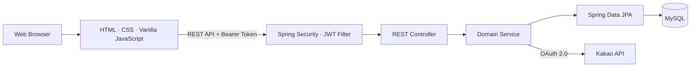
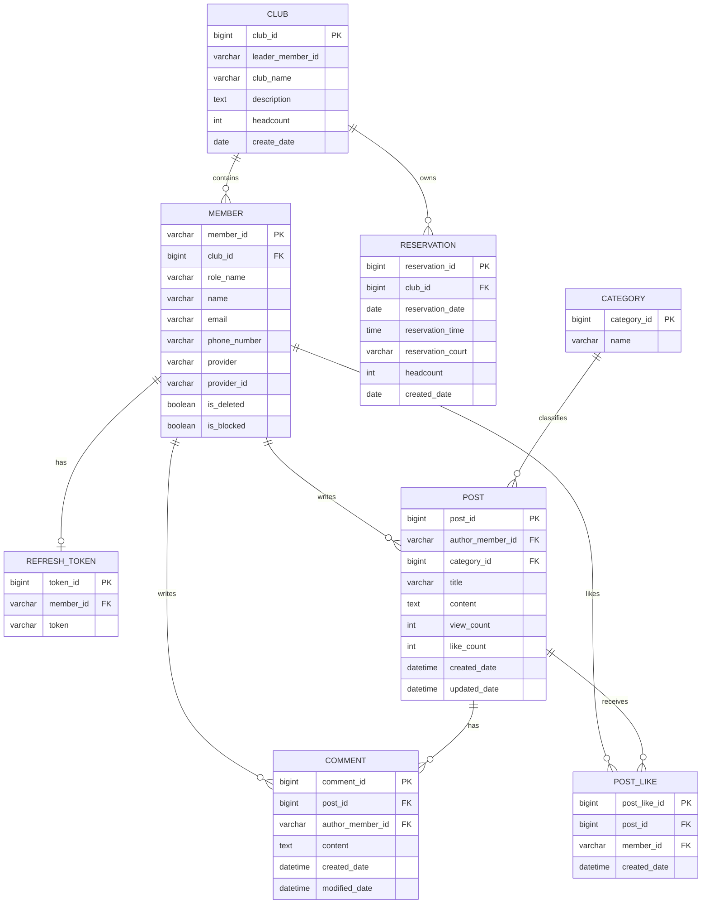

<p align="center">
  
</p>

<h1 align="center">BookKOK</h1>

<p align="center">
  단체를 기반으로 배드민턴 코트의 예약 현황을 확인하고<br>
  예약·단체·커뮤니티를 한곳에서 관리하는 웹 서비스
</p>

<p align="center">
  
  
  
  
  
</p>

---

## 프로젝트 소개

BookKOK은 배드민턴 코트의 예약 가능 여부를 날짜와 시간대별로 확인하고, 소속 단체를 기준으로 예약을 생성하고 관리할 수 있는 서비스입니다.

코트 예약뿐 아니라 단체 가입과 운영, 게시글과 댓글을 통한 커뮤니티, 회원·예약·카테고리를 관리하는 관리자 기능을 하나의 웹 애플리케이션으로 제공합니다.

## 팀원 소개

| 이름 | 역할 | 담당 영역 |
|---|---|---|
| **석종수** | 팀장 | 예약 시스템, 관리자 기능, 프로젝트 관리 |
| **안제홍** | 팀원 | 코트 관리, 게시판 |
| **이진희** | 팀원 | 단체 기능, 예약 조회 및 취소 |
| **정민주** | 팀원 | JWT 인증·인가, 카카오 로그인, 자체 회원가입·로그인, 마이페이지 |

## 실행 화면

> 화면 구성 확인을 위해 예시 데이터를 사용한 로컬 실행 화면입니다.

| 로그인 | 시설 예약 |
|---|---|
|  |  |

| 단체 관리 | 게시판 |
|---|---|
|  |  |

## 주요 기능

### 예약

- 월 단위 예약 현황 조회
- 날짜 → 시간 → 코트 순서의 예약 절차
- 08:00~21:00 시간대와 5개 코트의 예약 가능 여부 표시
- 날짜·시간·코트 조합을 이용한 중복 예약 사전 검사
- 소속 단체 정보와 예약자 연락처 자동 입력
- 단체별 예약 목록과 예약 상세 조회
- 예약 취소

### 단체

- 단체 생성 및 단체명 중복 검사
- 전체 단체 조회와 이름 검색
- 단체 상세 및 소속 회원 목록 조회
- 단체 가입과 탈퇴
- 단체장 권한을 이용한 회원 강퇴
- 단체장 위임과 단체 삭제
- 가입·탈퇴에 따른 소속 및 회원 수 갱신

### 회원과 인증

- 자체 회원가입 및 로그인
- 카카오 OAuth 로그인과 신규 회원 자동 등록
- BCrypt 기반 비밀번호 암호화
- JWT Access Token 기반 요청 인증
- 사용자별 Refresh Token 저장
- 회원정보 조회·수정 및 비밀번호 변경
- 회원 소프트 탈퇴

### 게시판

- 카테고리 기반 게시글 작성·조회·수정
- 게시글 상세 조회수 집계
- 사용자별 좋아요 등록·취소
- 댓글 작성과 목록 조회
- 게시글·댓글 작성자 권한 검사
- 게시글 삭제 시 소속 댓글 연쇄 삭제

### 관리자 API

- 관리자 역할 재검증
- 회원 목록·상세 조회 및 차단 상태 변경
- 전체 예약 조회와 날짜별 검색
- 예약 강제 취소
- 게시판 카테고리 생성·조회·수정·삭제

## 핵심 구현

### Stateless JWT 인증

Spring Security를 Stateless 방식으로 구성하고, 모든 인증 요청에서 `Authorization: Bearer <token>` 헤더를 검사합니다. JWT 필터는 토큰의 서명과 만료 여부를 검증한 뒤 사용자 ID와 역할을 `SecurityContext`에 등록합니다.

- Access Token 유효기간: 30분
- Refresh Token 유효기간: 7일
- JWT Claim을 이용한 사용자 역할 전달
- 회원별 Refresh Token 저장 및 갱신
- 인증 실패와 권한 부족 응답 처리 분리

### 도메인 규칙을 서비스 계층에서 관리

단체 생성·가입·탈퇴·강퇴·위임과 같은 상태 변경을 트랜잭션 안에서 처리합니다. 단체장 여부와 게시글·댓글 작성자 여부도 서비스 계층에서 확인해 컨트롤러와 비즈니스 규칙을 분리했습니다.

관리자 기능은 화면에 표시된 JWT 역할만 신뢰하지 않고, 현재 사용자 정보를 데이터베이스에서 다시 조회해 `ADMIN` 역할을 검증합니다.

### 예약 가능 여부 계산

월별 예약 데이터를 날짜와 시간으로 그룹화해 마감 시간대를 계산하고, 선택한 시간에 이미 예약된 코트를 비활성화합니다. 서버에서는 예약 저장 전에 날짜·시간·코트 조합의 기존 예약을 다시 확인합니다.

### 공통 프런트엔드 흐름

정적 HTML을 애플리케이션 셸로 사용하고, URL 패턴에 맞는 화면 렌더러를 실행하는 클라이언트 라우터를 구성했습니다. 공통 API 함수가 JWT 첨부, 응답 파싱, 인증 오류 처리와 사용자 입력 이스케이프를 담당합니다.

## 시스템 구성



백엔드는 기능 단위로 패키지를 분리하고 각 도메인 안에서 Controller, Service, Repository, DTO, Entity 계층을 구성했습니다.

```text
com.bookkok
├── member        # 회원, 자체 로그인, 카카오 로그인, 토큰
├── security      # JWT 필터와 Spring Security 설정
├── reservation   # 예약 생성, 조회, 취소
├── club          # 단체와 소속 회원 관리
├── board         # 게시글, 댓글, 카테고리, 좋아요
├── admin         # 회원, 예약, 카테고리 관리
├── global        # 공통 설정
└── view          # 화면 경로 전달
```

## ERD



## 기술 스택

| 영역 | 기술 | 사용 목적 |
|---|---|---|
| Language | Java 21 | 서버 애플리케이션 개발 |
| Backend | Spring Boot 4.0.6, Spring Web MVC | REST API와 웹 요청 처리 |
| Security | Spring Security, JJWT 0.11.5, BCrypt | 인증·인가와 비밀번호 암호화 |
| Persistence | Spring Data JPA, Hibernate | 엔티티 영속성과 데이터 접근 |
| Database | MySQL | 서비스 데이터 저장 |
| Frontend | HTML, CSS, Vanilla JavaScript | 화면 구성과 클라이언트 라우팅 |
| OAuth | Kakao Login API | 소셜 로그인 |
| Build | Maven Wrapper | 빌드 및 의존성 관리 |
| Utility | Lombok, Jakarta Validation | 반복 코드 축소와 요청 검증 |

## 주요 API

| 도메인 | Method | Endpoint | 설명 |
|---|---|---|---|
| 인증 | `POST` | `/api/auth/login` | 자체 로그인 및 토큰 발급 |
| 인증 | `GET` | `/login/kakao/auth-code` | 카카오 로그인 콜백 |
| 회원 | `POST` | `/api/members/signup` | 회원가입 |
| 회원 | `GET` | `/api/members/me` | 내 정보 조회 |
| 회원 | `PUT` | `/api/members/update` | 내 정보 수정 |
| 예약 | `GET` | `/api/reservations/calendar` | 기간별 예약 현황 조회 |
| 예약 | `POST` | `/api/reservations` | 예약 생성 |
| 예약 | `GET` | `/api/reservations/my` | 단체별 예약 목록 조회 |
| 예약 | `DELETE` | `/api/reservations/{reservationId}` | 예약 취소 |
| 단체 | `GET` | `/api/clubs` | 단체 목록 조회 |
| 단체 | `POST` | `/api/clubs` | 단체 생성 |
| 단체 | `POST` | `/api/clubs/{clubId}/join-requests` | 단체 가입 |
| 단체 | `PATCH` | `/api/clubs/{clubId}/leader` | 단체장 위임 |
| 게시판 | `GET` | `/api/posts` | 게시글 목록 조회 |
| 게시판 | `POST` | `/api/posts` | 게시글 작성 |
| 게시판 | `POST` | `/api/posts/{postId}/like` | 좋아요 등록·취소 |
| 게시판 | `POST` | `/api/posts/{postId}/comments` | 댓글 작성 |
| 관리자 | `GET` | `/api/admin/users` | 회원 목록 조회 |
| 관리자 | `GET` | `/api/admin/reservations` | 전체 예약 조회 |
| 관리자 | `POST` | `/api/admin/category` | 카테고리 생성 |
